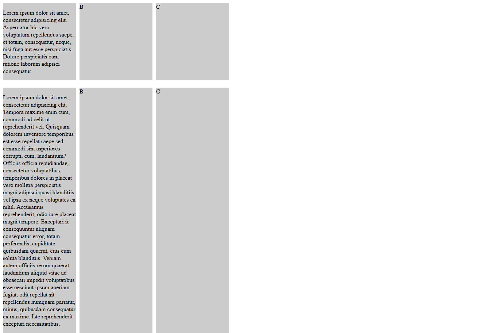

#Equal Column Heights with Javascript & jQuery

Author: Carlos Maldonado @choquo | License: MIT 

**Require jQuery**

This approach let you resize columns inside different parent rows, see the image below.

	

